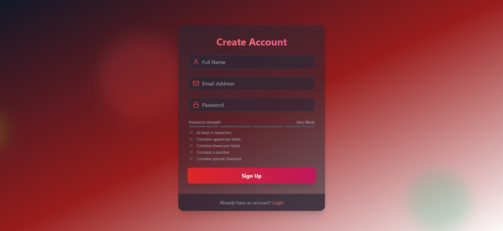

# 🔐 MERN Authentication System

A secure, full-featured User Authentication System built with Node.js, Express, MongoDB, and React. It supports full user workflows including registration with email verification, JWT-based login, and password reset via secure email links.

 <!-- Update path as necessary -->

---

## 📋 Table of Contents

- [Overview](#-overview)
- [Features](#-features)
- [BuiltWith](#-builtwith)
- [Installation](#-installation)
- [Usage](#-usage)
- [Configuration](#-configuration)
- [Examples](#-examples)
- [Contact](#-contact)
- [Credits](#-credits)

---

## 📖 Overview

This project is a secure and production-ready authentication system built using:

- **Node.js + Express** (Backend)
- **MongoDB** (Database)
- **React** (Frontend)

### Key Capabilities

- Email verification
- Secure JWT-based authentication
- Password reset via tokenized links
- Protected dashboard route

---

## ✨ Features

- ✅ **User Registration**: Sign up using full name, email, and secure hashed password
- ✅ **Email Verification**: Activate accounts via confirmation email (uses Mailtrap)
- ✅ **JWT Login**: Authenticated via secure HTTP-only cookies
- ✅ **Protected Routes**: Access restricted to verified users only
- ✅ **Forgot & Reset Password**: Tokenized link with secure reset form
- ✅ **Environment Configuration**: Fully configurable via `.env` variables

---
## 🛠 Built With

This project uses the following major technologies:

- 
- 
- 
- 
- 
- 
- 
- 
- 
- 

---


## ⚙️ Installation

### 1. Clone the Repository
   ```sh
   git clone https://github.com/amrashraf15/MERN-AUTH.git
    cd MERN-AUTH
   ```
2. Install Backend Dependencies
   ```sh
   cd backend
    npm install
   ```
3. Set Up Environment Variables
   ```js
     PORT=5001
    MONGODB_URI=your_mongodb_connection_string
    JWT_SECRET=your_jwt_secret
    CLIENT_URL=http://localhost:5173
    EMAIL_USER=your_mailtrap_username
    EMAIL_PASS=your_mailtrap_password
   ```
4. Start the Backend Server
   ```sh
   npm run start
    # Runs on http://localhost:5001
   ```
   
 5. Install Frontend Dependencies
     ```sh
       cd ../frontend
        npm install
      ```


